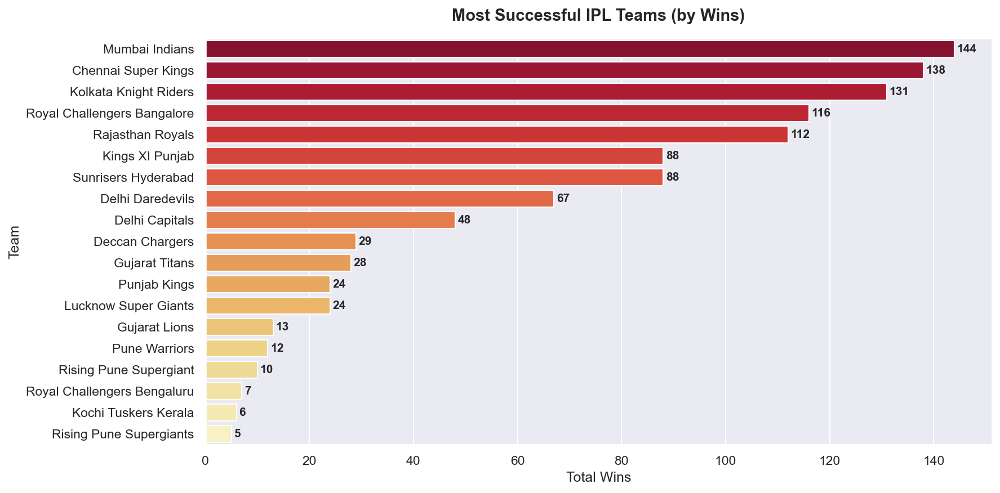
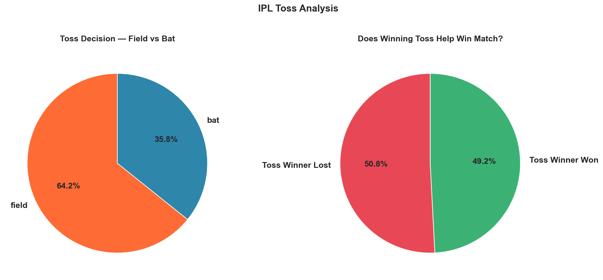
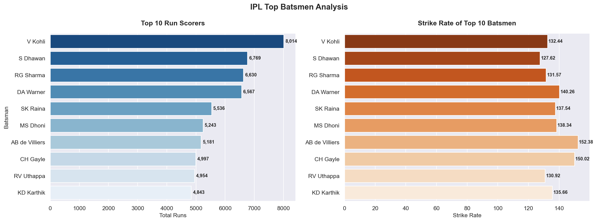
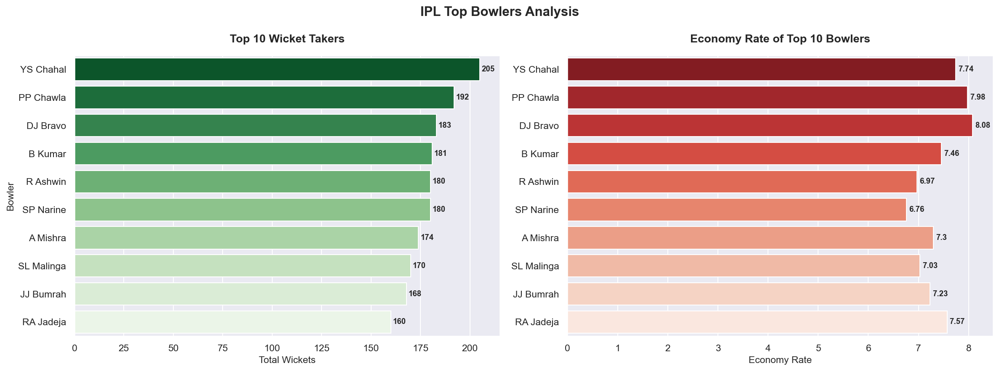
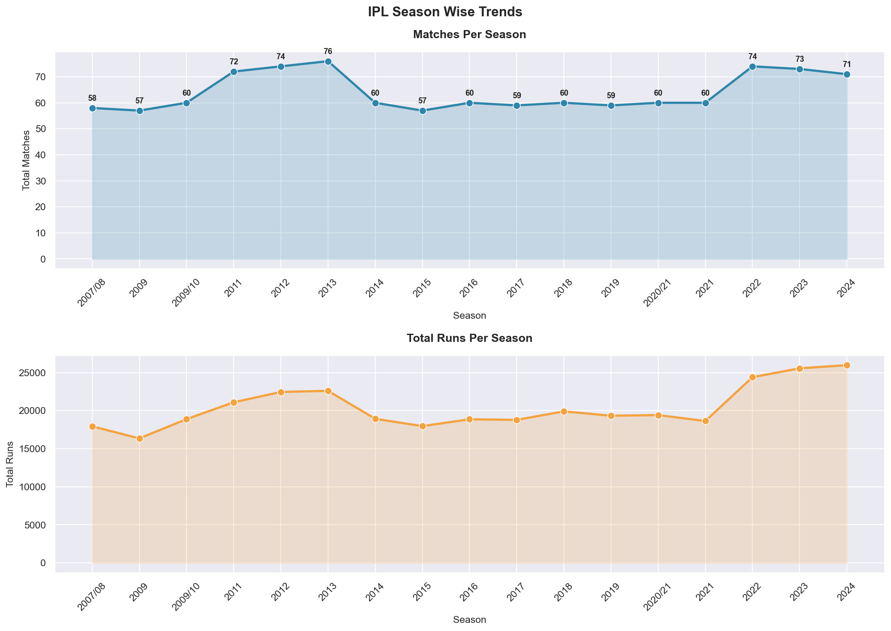
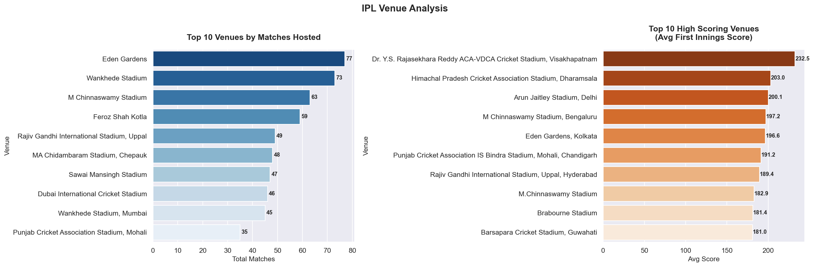
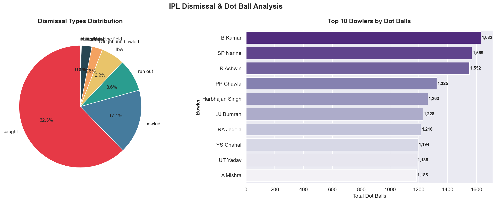
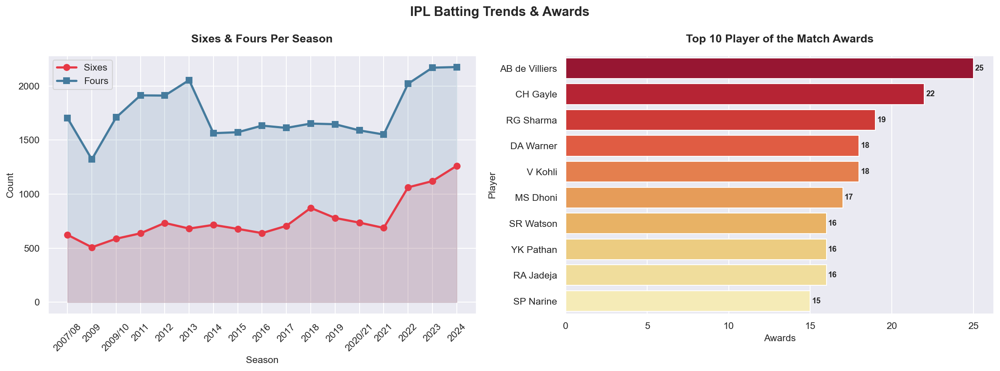

# 🏏 IPL Data Analysis (2008–2024)

Exploratory Data Analysis of **17 seasons of Indian Premier League** cricket using Python.  
Covers team performance, batting & bowling records, toss patterns, venue analysis, and season trends.

---

## 📊 Visualizations Preview

| Chart | Description |
|-------|-------------|
|  | Most Successful Teams |
|  | Toss Analysis |
|  | Top Batsmen |
|  | Top Bowlers |
|  | Season Trends |
|  | Venue Analysis |
|  | Dismissal Analysis |
|  | Batting Trends & Awards |

---

## 🎯 Business Questions Answered

- Which IPL team has the most wins across all seasons?
- Who are the top run scorers and wicket takers?
- Does winning the toss help win the match?
- Which venues host the most matches and have highest scores?
- How have batting trends (sixes/fours) changed over seasons?
- What are the most common dismissal types?
- Who has won the most Player of the Match awards?

---

## 🛠️ Tools & Libraries

| Tool | Purpose |
|------|---------|
| Python | Core programming language |
| Pandas | Data loading, cleaning, manipulation |
| NumPy | Numerical computations |
| Matplotlib | Base visualizations |
| Seaborn | Advanced statistical charts |
| VS Code + Jupyter | Development environment |

---

## 📦 Dataset

- **Source:** [Kaggle — IPL Complete Dataset 2008–2020](https://www.kaggle.com/datasets/patrickb1912/ipl-complete-dataset-20082020)
- **Period:** 2008 – 2024
- **Files:** `matches.csv` · `deliveries.csv`

| File | Rows | Columns | Description |
|------|------|---------|-------------|
| matches.csv | 1,090 | 20 | Match-level data |
| deliveries.csv | 260,920 | 17 | Ball-by-ball data |

---

## 📈 Key Statistics

```
📅 Seasons        : 17 (2008 – 2024)
🏏 Total Matches  : 1,090
🏟️ Total Venues   : 58
👕 Total Teams    : 19
🏃 Total Runs     : 3,47,756
6️⃣ Total Sixes    : 13,051
4️⃣ Total Fours    : 29,850
🎯 Total Wickets  : 12,950
```

---

## 🔍 Key Insights

### 🏆 Team Performance
- **Mumbai Indians** most successful — **144 wins** across 17 seasons
- **Chennai Super Kings** close second — **138 wins**
- Top 3 teams (MI, CSK, KKR) combined **413 wins** out of 1,090 matches

### 🏏 Batting
- **V Kohli** all-time leading run scorer — **8,014 runs**
- **AB de Villiers** highest strike rate among top scorers — **152.38**
- Sixes have increased significantly since 2022 — T20 becoming more aggressive

### 🎯 Bowling
- **YS Chahal** all-time wicket leader — **205 wickets**
- **SP Narine** best economy rate among top bowlers — **6.76**
- **B Kumar** most dot balls — **1,632**
- **Caught** most common dismissal — **62.3%** of all wickets

### 🎲 Toss
- Teams prefer to **field first** — **64.2%** of toss decisions
- Toss winning has **no significant advantage** — 49.2% vs 50.8% win rate

### 🏟️ Venues
- **Eden Gardens** most matches hosted — **77 matches**
- **Visakhapatnam** highest scoring venue — avg **232.5** first innings

### 🌟 Awards
- **AB de Villiers** most Player of the Match — **25 awards**
- **CH Gayle** second — **22 awards**

---

## 📁 Project Structure

```
IPL-Analysis/
├── data/
│   ├── matches.csv
│   └── deliveries.csv
├── output/
│   ├── most_successful_teams.png
│   ├── toss_analysis.png
│   ├── top_batsmen.png
│   ├── top_bowlers.png
│   ├── season_trends.png
│   ├── venue_analysis.png
│   ├── dismissal_analysis.png
│   └── batting_trends.png
├── ipl_analysis.ipynb
└── README.md
```

---

## ⚙️ How to Run

```bash
# 1. Clone the repository
git clone https://github.com/chetanupadhayay/IPL-Data-Analysis

# 2. Install required libraries
pip install pandas numpy matplotlib seaborn

# 3. Download dataset from Kaggle and place in data/ folder

# 4. Open notebook
code ipl_analysis.ipynb
```

---

## 👨‍💻 Author

**Chetan Upadhayay**  
Aspiring Data Analyst  
📧 chetanupadhayay24@gmail.com  
🔗 [linkedin.com/in/chetan-upadhayay](https://www.linkedin.com/in/chetan-upadhayay)

---

*Dataset courtesy of Kaggle · IPL Complete Dataset*
